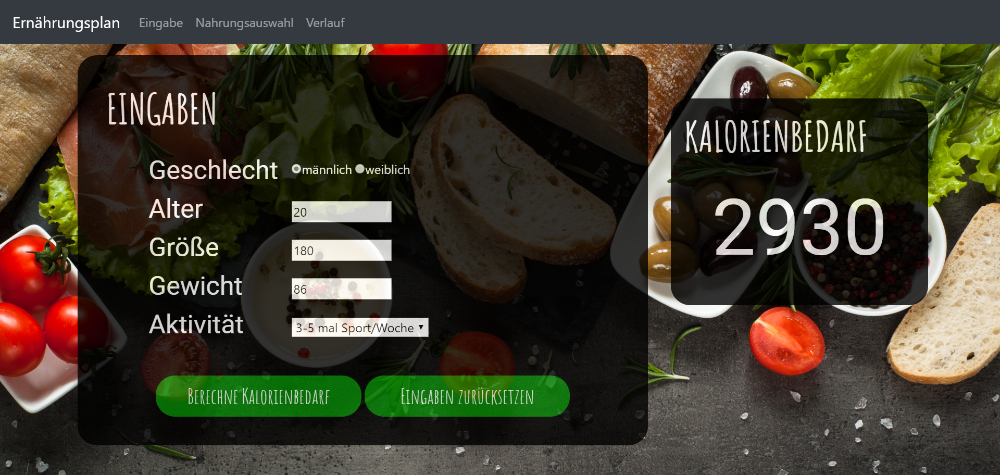
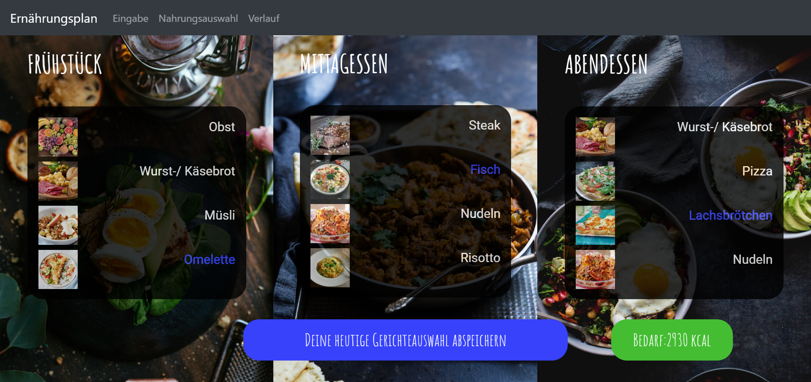
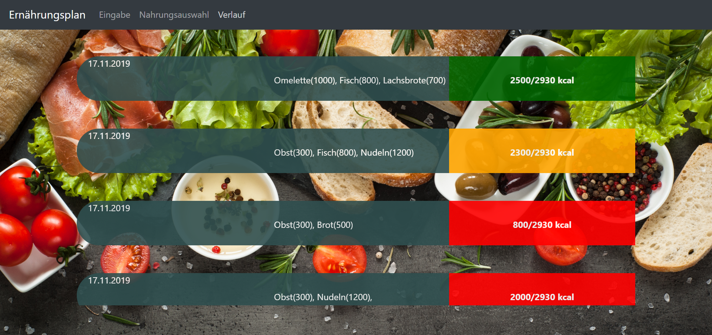

Anwendung "Ernährungsplan"
===============================

Kurzbeschreibung
----------------
Unsere Browserapp "Ernährungsplan" ermittelt den individuellen Kalorienbedarf und bietet verschiedene Gerichte zu Frühstück, Mittag und Abendessen an. Der Benutzer kann sich  entsprechend seines Kalorienbedarfs ein Frühstück, Mittagessen und Abendessen zusammenstellen. Am Ende des Tages kann er seine Malzeiten durch einen Klick auf das jeweilige Bild auswählen und durch Betätigen des Buttons "Deine heutige Gerichtsauswahl abspeichern" im Verlauf ablegen.
Im Verlauf wird für jeden Tag die erreichte Kalorienanzahl angezeigt und durch ein Ampelsystem bewertet. Zum Beispiel bedeutet grün, dass die erreichte Kalorienanzahl in der Nähe des Kalorienbedarfs liegt.

Unsere Browserapp haben wir für den Google Chrome Webbrowser angepasst. Gelegentlich wurde beim Starten zunächst ein schwarzer Bildschirm angezeigt. Mit "STRG+Shift+Entf -> Bilder und Dateien im Cache löschen" lässt sich dies vermeiden.

Anmerkung Datenbank(Dexie):
Als Primärschlüssel wurde eine Id mit Autoincrement verwendet. Diese lässt sich leider nicht zurücksetzen. Auch nicht beim Löschen aller Datensatze durch "clear()". Werden die Datensätze durch clear() gelöscht, muss die Id (da sie nicht mitgelöscht wird), durch die Variable idStart (Zeile 18 verlauf.js) auf die Id des ersten neuen Datensatz gesetzt werden.

Bei folgendem Fehler: "Unhandled rejection: OpenFailedError: VersionError The requested version (20) is less than the existing version (30)" muss die Version des Datenbankschemas in Zeile 15 und 18 der database.js auf 1 und 2 gesetzt werden. Das kommt daher, dass je nach Contributer durch vorheriges Löschen anders eingestellt werden müssen (Version 1und2 bzw 2und2)

Verwendete Technologien
-----------------------

Die App nutzt den Node Package Manager npm als Paketverwaltung. Auf diese
Weise werden der Application Bundler ParcelJS sowie eine Hand voll externe
Bibliotheken für die Anwendung installiert.

Folgende Entwicklungswerkzeuge kommen stattdessen zum Einsatz:

 * [Atom:](https://atom.io/) Spezieller Texteditor für Webentwickler und Programmierer
 * [git:](https://git-scm.com/") Versionsverwaltung zur gemeinsamen Arbeit am Quellcode
 * [npm:](https://nodejs.org/") Paketverwaltung zum automatischen Download abhängiger Bibliotheken
 * [Parcel:](https://parceljs.org/") Web Application Bundler und Entwicklungsserver

Zusätzlich werden folgende Bibliotheken genutzt:

 * [Navigo:](https://github.com/krasimir/navigo) Single Page Router zur Vereinfachung der Navigation innerhalb der App
 * [Dexie:](https://dexie.org) Datenbank zum Speichern der konsumierten Mahlzeiten und des Kalorienbedarfs
 * [Bootstrap:](https://getbootstrap.com/) Bootstrap ist ein freies Frontend-CSS-Framework

UI-Skizzen und Screenshots
--------------------------

<table style="max-width: 100%;">
    <tr>
        <td>
            
        </td>
        <td>
            
        </td>
        <td>
            
        </td>
    </tr>
    <tr>
        <td>
            Eingabe
        </td>
        <td>
            Nahrungsauswahl
        </td>
        <td>
            Verlauf
        </td>
    </tr>
</table>

Gruppenmitglieder
-----------------
Marius Bauer, Julian Jülg, Johannes Rieder
